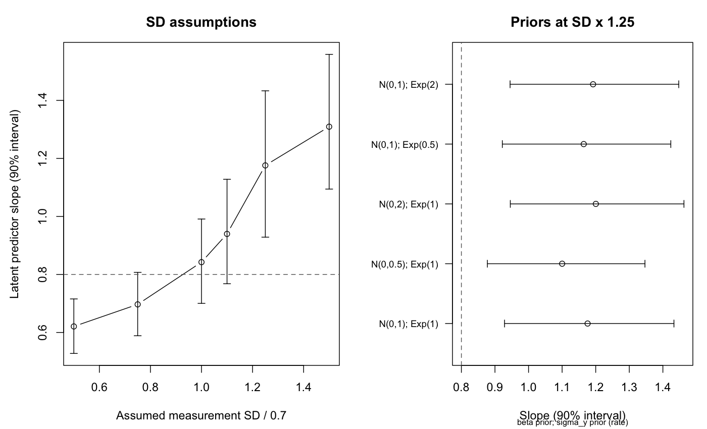

# 測定誤差SDを変えると、何が変わるか

**この合成例では、正の効果という方向は調べた範囲で保たれますが、効果の大きさは測定誤差SDの仮定に敏感でした。** SDを1倍から1.25倍にすると、潜在説明変数の回帰係数の事後平均は0.842から1.176へ約40%増えました。計算上の診断停止は解消しましたが、「SDの仮定に頑健」と結論する結果ではありません。

## 問いと比較の設計

外部情報として与える測定誤差SDが不確かなとき、説明変数と目的変数の関係についてどこまで同じ結論を維持できるかを調べます。対象は説明変数の測定誤差SDで、基準値0.7の1.25倍は0.875、誤差分散は1.5625倍です。目的変数の残差SDは別の未知母数として推定します。

`measurement_data()`が生成する160人分の同じ`y, xobs`を全条件で使います。生成時の回帰係数は0.8、測定誤差SDは0.7、目的変数の残差SDは0.6です。SDの仮定を変えるたびにデータを作り直すと標本の違いが混ざるため、観測データを固定します。

- 主解析：測定誤差SDを0.5・0.75・1・1.1・1.25・1.5倍にする6条件。priorは共通。
- prior感度分析：1倍と1.25倍で、回帰係数priorのSDを1から0.5または2へ、残差SDの指数priorのrateを1から0.5または2へ、それぞれ一つずつ変更する8条件。
- 実装検証：数値積分による尤度照合、1倍条件のbrmsとの事後平均比較、1.25倍条件の独立seedでの再実行。

比較範囲は実行前に固定しました。全14条件で良い診断を得るために、都合の悪い条件を外したり診断基準を緩めたりしていません。priorの組合せを網羅した実験ではありません。

## 同じモデルを計算しやすい形で書く

元のbrms `mi()`モデルは、真の説明変数を各人の潜在変数としてサンプリングします。母数をθ=(α, β, μ, τ, σ)、既知の測定誤差SDをsとすると、

$$
x_i\sim N(\mu,\tau^2),\quad w_i\mid x_i\sim N(x_i,s_i^2),\quad
y_i\mid x_i\sim N(\alpha+\beta x_i,\sigma^2).
$$

ここで`w = xobs`です。測定誤差と目的変数の誤差は、真の説明変数で条件付けたとき独立と仮定します。主解析のpriorはα, β, μにそれぞれN(0,1)、τ, σにそれぞれExponential(rate=1)です。

正規分布の条件付き分布を使うと、次の同じ同時尤度を得られます。

$$
V_i=\tau^2+s_i^2,\quad
m_i=\mu+\frac{\tau^2}{V_i}(w_i-\mu),\quad
v_i=\frac{\tau^2s_i^2}{V_i},
$$

$$
w_i\sim N(\mu,V_i),\qquad
y_i\mid w_i\sim N(\alpha+\beta m_i,\sigma^2+\beta^2v_i).
$$

この表記のNの第2引数は分散です。Stanの`normal_lpdf`には平方根を取り、SDとして渡します。**`w`の周辺尤度も含めて**積分するため、潜在説明変数の分布の情報を落としません。priorと観測データは同じで、推定する母数は5個になります。個人別の潜在値の事後分布はこのスクリプトでは出力しません。

旧実装の1.25倍条件では、σと潜在値を一緒に動かすサンプリングでR-hat・ESS・E-BFMIが悪化しました。新実装では同じ尤度を積分したところ診断が改善しました。σが0に近い領域も含む事後分布と、多数の潜在変数を同時にサンプリングする形の組合せが、旧実装の計算困難に関わったと考えられます。**事前分布を変えて診断を通した結果ではありません。**

検証では、正・負・0の回帰係数、異なる誤差SD、残差SD0.08を含む3設定で、元の潜在変数尤度をRの`integrate()`で数値積分し、実際にStanのmodel blockで使う密度関数と照合しました。対数尤度の差は最大約2.7×10⁻¹⁵でした。brmsとの5母数の事後平均差と、1.25倍の独立seedによる平均差は、いずれも4×合成MCSE以内でした。この数値照合だけを同値性の証明とせず、上の式とpriorの対応を根拠にします。

## 結果：方向と大きさを分ける

2026-09-22のmacOS実行結果です。R 4.6.1、CmdStanR 0.9.0、CmdStan 2.39.0、brms 2.23.0を使用しました。各条件は4 chains、各2000 warmup＋4000 sampling、seed=20260922です。独立再実行はseed=20261001です。

| SD倍率 | 仮定したSD | βの事後平均 | 90%信用区間 |
|---|---:|---:|---|
| 0.50 | 0.350 | 0.621 | [0.528, 0.716] |
| 0.75 | 0.525 | 0.697 | [0.589, 0.807] |
| 1.00 | 0.700 | 0.842 | [0.700, 0.991] |
| 1.10 | 0.770 | 0.940 | [0.768, 1.128] |
| 1.25 | 0.875 | 1.176 | [0.929, 1.433] |
| 1.50 | 1.050 | 1.309 | [1.094, 1.559] |

すべての90%区間は正の側ですが、平均値は0.621〜1.309と大きく変わります。特に1.25倍では、生成した真値0.8を90%区間が含みません。これは誤ったSDを仮定した一つの標本での結果であり、反復実験における偏り・coverageの推定ではありません。実データでは真値を照合できないため、測定誤差SDを支える外部の校正情報が必要です。

### 1.25倍条件でpriorを変える

| βのprior | σのprior（rate） | βの事後平均 | 90%信用区間 |
|---|---|---:|---|
| N(0,1) | Exponential(1) | 1.176 | [0.929, 1.433] |
| N(0,0.5) | Exponential(1) | 1.100 | [0.877, 1.347] |
| N(0,2) | Exponential(1) | 1.200 | [0.946, 1.463] |
| N(0,1) | Exponential(0.5) | 1.164 | [0.922, 1.424] |
| N(0,1) | Exponential(2) | 1.192 | [0.945, 1.447] |

Nの第2引数はこの表ではpriorの**SD**、Exponentialの引数は**rate**です。1倍条件での追加prior比較の平均は0.822〜0.846でした。試したprior範囲の影響は、測定誤差SDを1倍から1.25倍へ変えた影響より小さいものの、1.25倍ではprior依存も強くなっています。この比較を、すべてのpriorやその組合せに対する頑健性へ広げません。



点は事後平均、線は90%信用区間、破線は生成したβ=0.8です。右図のNはβのprior（SD）、Expは残差SDσのprior（rate）です。

## 診断とモデル批判

14条件全体の最大R-hatは1.00361、最小bulk ESSは3584、最小tail ESSは2629、最小chain E-BFMIは0.844でした。divergenceと最大tree depth到達はすべて0です。1.25倍のβのMCSEは約0.0023でした。既存の停止規則（R-hat<1.01、ESS≥400、E-BFMI≥0.3、divergence=0、tree depth到達=0）を維持しています。

warmup初期には、探索中の提案値で非有限の平均や極端なSDが生じ、棄却されたメッセージがありました。保存ログではwarmup中のメッセージとして確認し、samplingの診断と区別しました。ログを削除して成功扱いにはしていません。

joint PPCでは`xobs, y`の平均・SD・共分散を確認しました。主解析6条件では、この5統計の観測値は各90%事後予測区間内にありました。ただし、この少数の要約統計でモデル全体が妥当と証明されたわけではありません。

観測された分散・共分散を母集団値にそのまま代入すると、残差分散を0以上に保つ測定誤差SDの目安は約0.945です。1.5倍の1.05はこれを超えます。ただし有限標本の不確実性を無視した**モーメントの目安であり、モデルの厳密な上限ではありません**。1.5倍ではσ<0.1の事後標本割合が約36%となり、残差を小さくする領域へ寄りました。1.25倍でもこの割合は約9.7%でした。MCMCが通ることと、仮定を支える情報が十分であることを分けて判断します。

## 再実行と成果物

配布パックのルートから実行します。既存の出力を保護するため、再実行には新しい出力先を指定してください。

```sh
Rscript --vanilla measurement-sensitivity.R
# 接続確認専用。数値的結論には使用しない
Rscript --vanilla measurement-sensitivity.R --smoke
```

`observation.R`の標準比較も、この積分消去した実装で0.75・1・1.25倍を実行します。詳しい感度分析は別の入口なので、タイムアウトの比較を再実行する必要はありません。

| ファイル | 記録すること |
|---|---|
| `sensitivity-plan.csv` / `measurement-data.csv` | 比較条件と同じ観測データ |
| `sensitivity-results.csv` | SD・prior・回帰係数・診断・残差SDの境界付近の割合 |
| `ppc-summary.csv` | 各条件の観測統計と事後予測区間 |
| `likelihood-equivalence.csv` | Stan密度と元の潜在変数モデルの数値積分の一致 |
| `brms-equivalence.csv` | 同じ1倍モデルの5母数の照合 |
| `independent-seed-check.csv` | 1.25倍の別seedによる再実行 |
| `*-data.json` / `*-diagnostics.csv` / `*-sampler.csv` | 実際のStan入力と各fitの診断 |
| `sensitivity-status.txt` | PASS、STOP、SMOKE_ONLYの区別 |

この報告の数値表は[参照CSV](reference-results/sensitivity-results.csv)として同梱しています。`reference-results/`は今回の検証結果で、利用者自身の実行は`outputs/`へ保存します。診断失敗はSTOPと推定値NAで記録し、詳細な感度分析スクリプトは異常終了します。構文やAPI等のエラーも成功へ読み替えません。

この分析は、正規の潜在説明変数、独立・正規の測定誤差、線形の条件付き平均という仮定の下で、SDと指定したpriorを変えたものです。非正規・相関誤差・未知の測定誤差SDを含む全モデルの検討や、実在する研究の効果推定は行っていません。

## 典拠

- [Stan User's Guide: measurement error](https://mc-stan.org/docs/stan-users-guide/measurement-error.html)：観測値と潜在的な真値を分けた測定モデル。
- [Stan: diagnostics and warnings](https://mc-stan.org/learn-stan/diagnostics-warnings.html)：診断とwarmup・samplingの警告の解釈。
- [brms: mi](https://paulbuerkner.com/brms/reference/mi.html)：比較元の潜在変数指定。

上の積分式と数値比較は、本演習のモデルについて導出・検証したものです。
